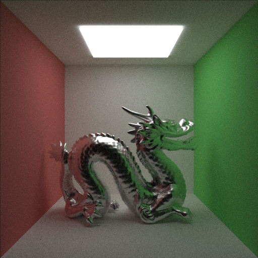
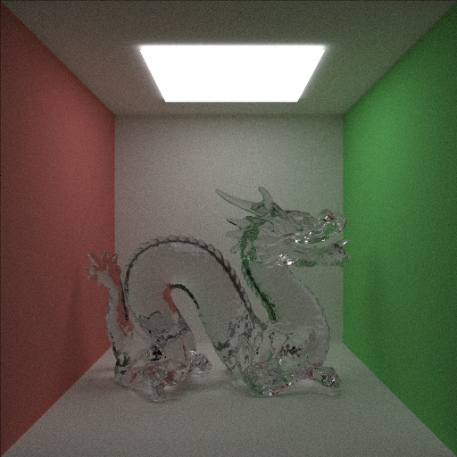

# Raytracing_With_Embree
CPU raytracer using Embree 3.0



## Build
This program use Embree 3.0 API. Install Embree from offcial site, and unzip that and put to /external directory.

[Embree](https://www.embree.org/)

```
mkdir build
cd build
cmake ..
make
```

If you can not compile by this command and get the error aboud find_package, change cmake command to 

```
cmake -Dembree_DIR=./external/embree-3.13.3.x86_64.linux/lib/cmake ..
```


## References
-[Embree](https://www.embree.org/)
-[embree-tinyobj-example@yumcyaWiz](https://github.com/yumcyaWiz/embree-tinyobj-example)